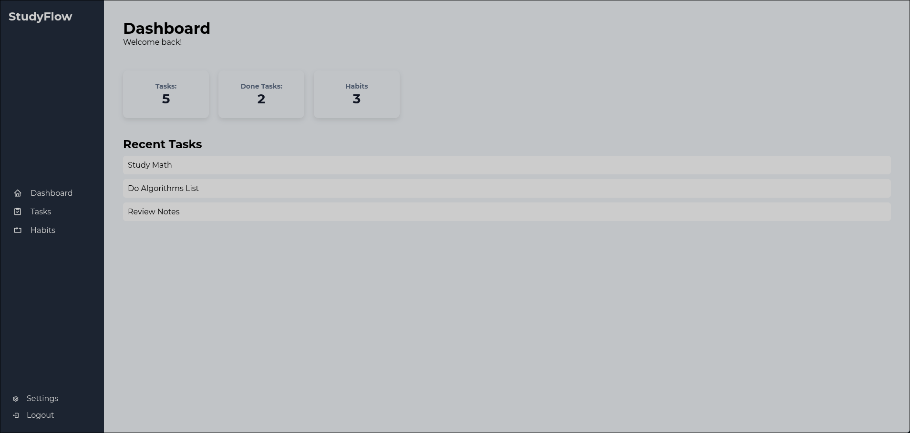
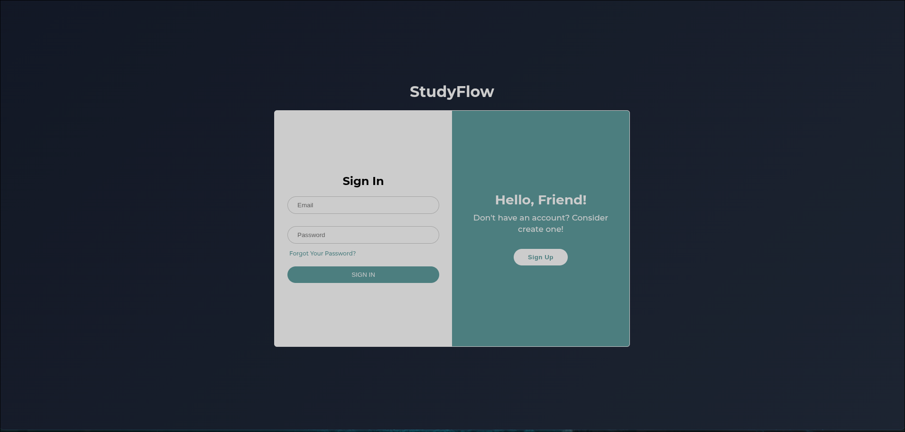

# StudyFlow

> Sistema Web para organização de estudos, tarefas e hábitos.

---

## 🧠 Visão do Produto

O **StudyFlow** é um sistema web desenvolvido para ajudar estudantes a organizar suas tarefas acadêmicas, hábitos diários e progresso de estudos em um único ambiente.

A proposta do sistema é oferecer uma interface simples, intuitiva e eficiente, permitindo que o usuário acompanhe suas atividades de forma visual através de um dashboard.

O público-alvo são estudantes universitários e pessoas que precisam gerenciar rotinas de estudo.

O diferencial do sistema está na integração entre tarefas e hábitos, promovendo maior produtividade e organização pessoal.

---

## 🎯 Objetivo

Facilitar a organização de estudos, permitindo que o usuário:

- Gerencie tarefas
- Acompanhe hábitos
- Visualize progresso
- Personalize a interface (modo claro/escuro)

---

## ⚙️ Funcionalidades

- Tela de Login / Cadastro
- Dashboard com resumo de atividades
- Gerenciamento de tarefas
- Controle de hábitos
- Página de configurações
- Alternância entre modo claro e escuro (Dark Mode)

---

## 🛠️ Tecnologias Utilizadas

- HTML5  
- CSS3  
- JavaScript  

---

## 📁 Estrutura do Projeto
/FrontEnd/src → páginas, componentes e estado do frontend
/FrontEnd/styles → estilos globais
/BackEnd/src → API, middlewares e rotas
/BackEnd/prisma → schema e seed do banco
/assets → imagens e ícones do projeto

---

## 🚀 Como Executar

1. Inicie o PostgreSQL e aplique o schema do banco
2. Rode o backend em `BackEnd/` com `npm run dev`
3. Sirva o frontend a partir de `FrontEnd/` com `python3 -m http.server 5001`
4. Abra `http://127.0.0.1:5001/index.html#login`

---

## 📌 Observações

Este projeto faz parte da disciplina **Desenvolvimento de Sistemas Web I**, com foco no desenvolvimento frontend utilizando HTML, CSS e JavaScript.

O sistema agora possui uma base de backend em `BackEnd/`, com API, Prisma e autenticação.

## Backend

O backend usa:

- `Node.js` + `Express`
- `Prisma`
- `PostgreSQL`
- `JWT` para autenticação

### Endpoints principais

- `POST /api/auth/register`
- `POST /api/auth/login`
- `GET /api/me`
- `GET /api/dashboard`
- `GET /api/tasks`
- `GET /api/habits`
- `GET /api/studies`
- `GET /api/communities`
- `GET /api/files`

---

## 👥 Equipe de desenvolvedores

- Gean Lima  

---

## 📷 Preview

